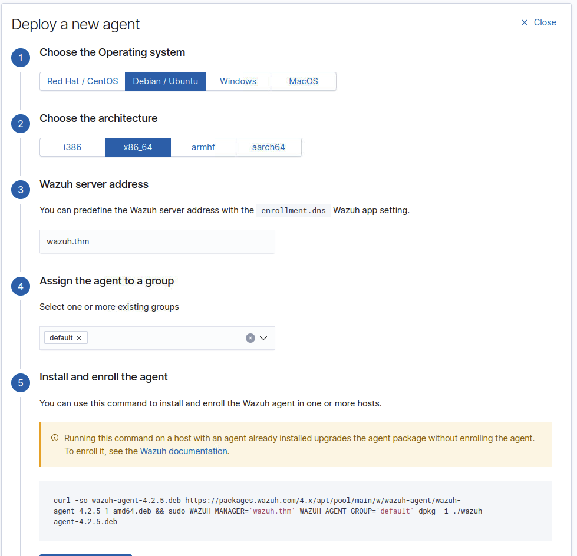

# 📘 Wazuh Agent Deployment Guide

This guide covers the process of deploying Wazuh agents on client systems to enable event and process monitoring for security and compliance purposes.

## 🛰️ What Are Agents?

Agents are installed on endpoints to monitor local activity, such as:

- Authentication events
- User management
- System processes

These agents forward logs to a centralized **Wazuh Manager (server)** for analysis and correlation.

## ⚙️ Prerequisites for Agent Deployment

Before deploying a Wazuh agent, you’ll need:

- ✅ The **Operating System** of the target machine
- ✅ The **IP address or DNS name** of the Wazuh server
- ✅ The **Agent Group** (optional, for organizing endpoints within Wazuh)

## 🚀 Launching the Deployment Wizard

To begin installing an agent:

1. Navigate to your Wazuh server dashboard.
2. Go to `Wazuh → Agents → Deploy New Agent`.
3. Follow the interactive wizard.

> 📸 Screenshot Example  
> *Include screenshot here*

---

## 🪟 Installing the Wazuh Agent on Windows

Use the command provided at **Step 4** of the wizard. This command downloads, installs, and configures the Wazuh agent.

> 📸 Screenshot Example  
> *Include Windows installation screenshot here*

---

## 🐧 Installing the Wazuh Agent on Debian/Ubuntu
> 📸 Screenshot Example  
> 

Likewise, copy the generated command and run it in your terminal:

```bash
# Example (replace with the actual command from the wizard)
curl -sO https://packages.wazuh.com/agent.sh && sudo bash agent.sh
📸 Screenshot Example
Include Debian/Ubuntu installation screenshot here


📌 Notes
The deployment wizard adjusts the install command based on OS and agent group.

Logs should start populating in the Wazuh dashboard after a successful install.
